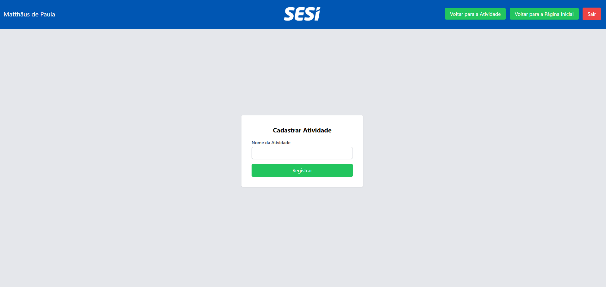
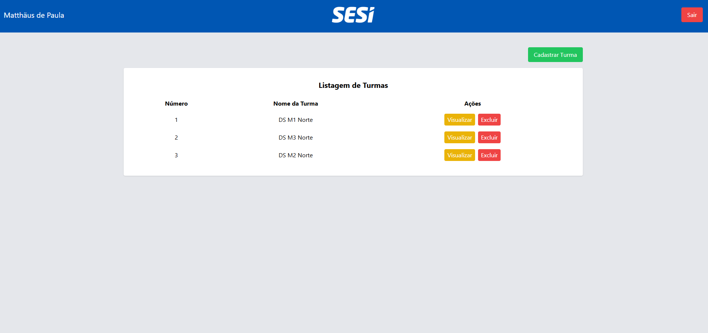

# Gerenciador de Tarefas

Desenvolvimento de um sistema que permite o professor se autenticar para visualizar, registrar e excluir suas turmas, assim como registrar atividades para as mesmas e sair do sistema. Projeto desenvolvido no técnico em Desenvolvimento de Sistema (SENAI).

## Motivação

Na educação, a falta de organização relacionada às atividades desenvolvidas pelos professores durante as aulas pode ocasionar problemas de gestão dos conhecimentos já trabalhados e avaliados. É fundamental, para que se possa atingir os objetivos educacionais, que os professores tenham controle sobre as atividades que serão aplicadas às turmas. Muitas escolas situadas em áreas remotas do Brasil não possuem um sistema para solucionar essa falta de organização, acarretando prejuízos aos estudantes, professores e ao processo educacional como um todo.

## Screenshots

